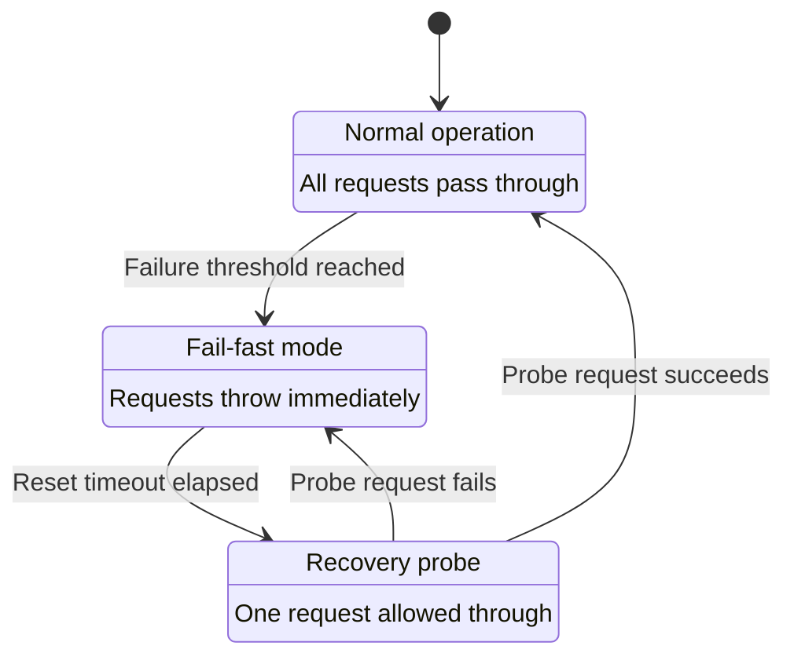

# Initialization

Before you can register payments, verify transactions, or issue refunds, you need to create a `Satim` client instance. This page explains every option available when constructing the client, how credentials are protected at runtime, and how to configure the HTTP transport layer for your specific deployment environment.

---

## Prerequisites

You need three credentials issued by [CIBWeb.dz](https://www.cibweb.dz/) — the administrative portal for Algerian CIB merchants:

| Credential | Description | Example |
|---|---|---|
| `username` | Your merchant API username | `"merchant_abc"` |
| `password` | Your merchant API password | `"s3cret"` |
| `terminalId` | The terminal identifier assigned to your merchant account | `"E010901345"` |

These credentials are sent with **every API request** to SATIM. If any of them are wrong, every call will fail with a `SatimInvalidCredentialsError`.

> **Where to find these:** Log in to [CIBWeb.dz](https://www.cibweb.dz/), navigate to your merchant dashboard, and locate the API credentials section. If you do not have API access, contact your CIBWeb account manager.

---

## Basic initialization

### Production

```typescript
import { Satim } from "numeric";

const satim = new Satim({
    username: process.env.SATIM_USERNAME,
    password: process.env.SATIM_PASSWORD,
    terminalId: process.env.SATIM_TERMINAL_ID,
});
```

This creates a client that sends requests to the **production** gateway at `https://cib.satim.dz/payment/rest`. Real money is moved when you use this client.

### Test mode (sandbox)

During development and integration testing, use the SATIM sandbox to avoid processing real transactions:

```typescript
const satim = new Satim({
    username: process.env.SATIM_TEST_USERNAME,
    password: process.env.SATIM_TEST_PASSWORD,
    terminalId: process.env.SATIM_TEST_TERMINAL_ID,
}).setTestMode(true);
```

When test mode is enabled, all requests are routed to `https://test2.satim.dz/payment/rest`. The sandbox simulates the full payment flow — registration, hosted form, confirmation — but no real money changes hands. Use separate credentials for the sandbox; production credentials will not work on the test gateway and vice versa.

> **Important:** `setTestMode()` returns a **new** client instance. The original instance is never modified. This is true of all setter methods in the SDK — they use an immutable fluent pattern. See the section on immutability below.

---

## Credential validation

The SDK validates credentials at construction time. If anything is missing, too long, or otherwise invalid, the constructor throws immediately — before any HTTP request is made.

| Rule | Error thrown |
|---|---|
| `username`, `password`, or `terminalId` is empty or missing | `SatimMissingDataError` |
| `username` or `password` exceeds 100 characters | `SatimInvalidArgumentError` |
| `terminalId` exceeds 16 characters | `SatimInvalidArgumentError` |

These limits match the SATIM gateway's field specifications (AN.100 for username/password, AN.16 for terminal ID). If you exceed them, SATIM would reject the request anyway — the SDK catches the problem earlier so you get a clear error message instead of a cryptic gateway response.

---

## HTTP client options

The second argument to the `Satim` constructor is an optional configuration object that controls how the SDK communicates with the SATIM gateway over HTTP. These settings affect **every request** made by the client instance.

```typescript
const satim = new Satim(credentials, {
    timeoutMs: 15_000,
    maxRetries: 3,
    circuitBreaker: {
        failureThreshold: 5,
        resetTimeoutMs: 30_000,
    },
});
```

### All options

| Option | Type | Default | Range | Description |
|---|---|---|---|---|
| `timeoutMs` | `number` | `30000` | 1,000 – 300,000 | The maximum number of milliseconds to wait for a single HTTP request to complete before aborting it. If the request is aborted due to timeout, it is classified as a transient failure and may be retried (see `maxRetries` below). |
| `maxRetries` | `number` | `2` | 0 – 10 | The maximum number of times a failed request is retried. Only **transient** failures are retried — specifically, HTTP 5xx responses (server errors on the SATIM side) and timeouts. Client errors (4xx) are never retried. When set to `0`, retries are disabled entirely and every request gets exactly one attempt. |
| `circuitBreaker` | `object` or `false` | Enabled with defaults | — | Configures the circuit breaker (explained in detail below). Pass `false` to disable the circuit breaker entirely. |
| `circuitBreaker.failureThreshold` | `number` | `5` | — | The number of **consecutive** transient failures (5xx or timeout) required to open the circuit. Once open, all subsequent requests fail immediately without touching the network. |
| `circuitBreaker.resetTimeoutMs` | `number` | `30000` | — | How long (in milliseconds) the circuit stays open before it transitions to the half-open state and allows one probe request through to test whether the gateway has recovered. |

### How the timeout works

Every HTTP request to the SATIM gateway gets its own `AbortController`. When the timer expires, the controller aborts the request, the SDK catches the resulting `AbortError`, and it wraps it in a `SatimUnexpectedResponseError` with `errorCategory: "timeout"` and `isTimeout: true`.

```typescript
try {
    await satim.register();
} catch (err) {
    if (err instanceof SatimUnexpectedResponseError && err.isTimeout) {
        // The gateway did not respond within the configured timeoutMs.
        // This could mean the gateway is slow, overloaded, or unreachable.
    }
}
```

**Choosing a timeout value:**

- **Default (30 seconds):** Suitable for most Algerian deployments. The SATIM gateway typically responds within 2–5 seconds, but occasional spikes up to 10–15 seconds have been observed during high-load periods (Eid promotions, back-to-school, end-of-month salary disbursements).
- **Lower (5–15 seconds):** Use if your application has strict latency budgets and you prefer fast failure over waiting. Combine with retries so transient slow responses are retried quickly rather than blocking the user.
- **Higher (45–60 seconds):** Use if your deployment has high network latency (e.g., routing through international proxies) or if you are seeing spurious timeouts during normal operation.

### How retries work

When a request fails with a transient error and retries are enabled, the SDK waits with **exponential backoff plus jitter** before retrying:

| Retry attempt | Base delay | With jitter (approximate) |
|---|---|---|
| 1st retry | 500 ms | 500 – 750 ms |
| 2nd retry | 1,000 ms | 1,000 – 1,500 ms |
| 3rd retry | 2,000 ms | 2,000 – 3,000 ms |

The jitter (a random value between 0 and 50% of the base delay) prevents multiple clients from retrying at the exact same moment — a phenomenon called the **thundering herd problem** that can overwhelm a recovering server.

**Which requests are retried:**

Not all SDK methods allow retries. Methods that create side effects (charging money, issuing refunds) are **not retried by default** because retrying them could cause double-charges. Only idempotent or read-only operations are retried:

| Method | Retried? | Reason |
|---|---|---|
| `register()` | Only if `idempotencyKey` is set | Without an idempotency key, retrying could create duplicate orders |
| `registerPreAuth()` | Only if `idempotencyKey` is set | Same as above |
| `safeRegister()` | Yes | Automatically sets an idempotency key |
| `safeRegisterPreAuth()` | Yes | Automatically sets an idempotency key |
| `status()` | Yes | Read-only — safe to retry |
| `confirm()` | No | Side-effecting (deposits the payment) |
| `refund()` | No | Side-effecting (moves money back) |
| `reverseOrder()` | No | Side-effecting (voids the authorization) |

---

## Circuit breaker

### The problem it solves

Without a circuit breaker, if the SATIM gateway goes down for an extended period, every request from your application waits the full timeout duration (30 seconds by default) before failing. If you have multiple users trying to pay at the same time, those requests pile up — each one consuming a connection, a worker thread, and server memory for 30 seconds before it gives up. This can exhaust your application's resources and cause cascading failures that affect parts of your system that have nothing to do with payments.

### How it works

The circuit breaker tracks consecutive transient failures (5xx responses and timeouts) across all requests made by a client instance. It has three states:



| State | What happens when you make a request |
|---|---|
| **CLOSED** | The request is sent normally. If it fails with a transient error, the consecutive failure counter increments. If the counter reaches `failureThreshold`, the circuit transitions to OPEN. If the request succeeds, the counter resets to zero. |
| **OPEN** | The request is **not sent**. Instead, the SDK throws a `SatimUnexpectedResponseError` with `errorCategory: "circuit_open"` immediately, without touching the network. This protects your application from resource exhaustion. The circuit stays open for `resetTimeoutMs` milliseconds. |
| **HALF_OPEN** | After the reset timeout elapses, the circuit allows **one** probe request through. If that request succeeds, the circuit transitions back to CLOSED and all subsequent requests flow normally. If the probe fails, the circuit returns to OPEN with a fresh reset timer. |

### Handling circuit-open errors

When the circuit is open, you should return a user-friendly error immediately rather than waiting:

```typescript
import { SatimUnexpectedResponseError } from "numeric";

try {
    const payment = await satim
        .amount(1500)
        .returnUrl("https://your-app.com/callback")
        .register();
} catch (err) {
    if (err instanceof SatimUnexpectedResponseError) {
        switch (err.errorCategory) {
            case "circuit_open":
                // Gateway is known to be down — fail fast
                return new Response(
                    "The payment gateway is temporarily unavailable. Please try again in a few minutes.",
                    { status: 503, headers: { "Retry-After": "60" } },
                );
            case "timeout":
                // Single request timed out
                return new Response(
                    "The payment gateway is not responding. Please try again.",
                    { status: 504 },
                );
            default:
                // Other unexpected error
                return new Response(
                    "An error occurred while processing your payment.",
                    { status: 502 },
                );
        }
    }
    throw err; // Re-throw non-SATIM errors
}
```

### Disabling the circuit breaker

If you want to handle gateway unavailability yourself (for example, using an external circuit breaker in your service mesh), disable the built-in one:

```typescript
const satim = new Satim(credentials, { circuitBreaker: false });
```

### Recommended configurations

| Environment | Suggested settings | Reasoning |
|---|---|---|
| **Production web app** | `timeoutMs: 15_000`, `maxRetries: 2`, `circuitBreaker: { failureThreshold: 5, resetTimeoutMs: 30_000 }` | Balance between responsiveness and resilience. Users see a payment failure within ~15–45 seconds. The circuit trips after 5 consecutive errors and automatically recovers. |
| **Background job processor** | `timeoutMs: 60_000`, `maxRetries: 3`, `circuitBreaker: { failureThreshold: 10, resetTimeoutMs: 60_000 }` | Latency is less critical. Allow more time and retries. Higher threshold avoids tripping the breaker on transient blips. |
| **Integration tests** | `timeoutMs: 45_000`, `maxRetries: 0`, `circuitBreaker: false` | No retries or circuit breaker — you want deterministic behavior in tests. Longer timeout because the sandbox can be slow. |
| **Serverless (Lambda / Workers)** | `timeoutMs: 10_000`, `maxRetries: 1`, `circuitBreaker: false` | Each invocation is stateless, so the circuit breaker state is lost between invocations. Disable it and rely on short timeouts instead. |

---

## Credential security

Credentials are stored internally in a module-private `WeakMap` and are **never** exposed as enumerable instance properties. This prevents accidental leakage through common JavaScript operations:

| Operation | Result |
|---|---|
| `JSON.stringify(satim)` | `username`, `password`, and `terminalId` all show as `"[REDACTED]"` |
| `console.log(satim)` | Same — custom `inspect` handler returns redacted values |
| `Object.keys(satim)` | Does **not** include `username`, `password`, or `terminalId` |
| `Object.getOwnPropertyDescriptor(satim, "username")` | Returns `undefined` — the property does not exist on the instance |
| `Reflect.ownKeys(satim)` | Does **not** include credential keys |
| `String(satim)` | Returns `"[SatimConfig credentials=REDACTED]"` |

This means you can safely pass a `Satim` instance to logging frameworks, error reporters (Sentry, Datadog), or serialization utilities without credentials leaking into logs, error reports, or network payloads.

### Best practices for credential management

1. **Always load credentials from environment variables or a secrets manager.** Never hardcode them in source code, even for testing.

   ```typescript
   // Good
   const satim = new Satim({
       username: process.env.SATIM_USERNAME!,
       password: process.env.SATIM_PASSWORD!,
       terminalId: process.env.SATIM_TERMINAL_ID!,
   });

   // Bad — credentials committed to version control
   const satim = new Satim({
       username: "merchant_abc",
       password: "s3cret",
       terminalId: "E010901345",
   });
   ```

2. **Never log outgoing request bodies.** The SATIM API requires `userName` and `password` as `application/x-www-form-urlencoded` POST parameters on every request. If your reverse proxies, WAFs, CDN edge nodes, or APM tools (Datadog, New Relic, Dynatrace) log raw request bodies, those logs will contain your credentials in plain text. Configure them to exclude POST body content for requests to `cib.satim.dz` and `test2.satim.dz`.

3. **Never run with `NODE_TLS_REJECT_UNAUTHORIZED=0` in production.** The SDK actively blocks this configuration — it throws a `SatimError` before sending any request if it detects TLS verification is disabled. This prevents credentials from being sent over an unverified connection where a man-in-the-middle could intercept them.

4. **Use direct HTTPS connections to the SATIM gateway.** Avoid TLS-terminating proxies that inspect POST bodies. If your infrastructure requires a forward proxy, ensure it is configured to pass HTTPS traffic through without decrypting it (CONNECT tunnel).

---

## Immutable fluent API

Every setter method on the `Satim` client returns a **new instance** with the updated value. The original instance is never modified. This design is called an immutable fluent interface, and it prevents a category of bugs where shared state leaks between requests.

```typescript
const base = new Satim(credentials);

// Each call returns a NEW instance — `base` is unchanged
const withAmount = base.amount(1500);
const withUrl = withAmount.returnUrl("https://example.com/callback");
const withLang = withUrl.language("AR");

// base._amount is still undefined
// withAmount._amount is 1500
// withUrl._amount is 1500, withUrl._returnUrl is "https://..."
// withLang has all three values set
```

This means you can safely share a `Satim` instance as a singleton and call setter methods concurrently from different requests without race conditions:

```typescript
// Safe: create once at startup
const satim = new Satim(credentials).setTestMode(true);

// Safe: each request builds its own chain from the shared base
app.post("/checkout", async (req) => {
    const payment = await satim
        .amount(req.body.amount)
        .returnUrl(`https://example.com/callback?session=${req.body.sessionId}`)
        .register();
    // ...
});
```

---

## Next step

Now that your client is initialized, proceed to [Registering a Payment](03-creating-payment.md) to create your first payment order.
