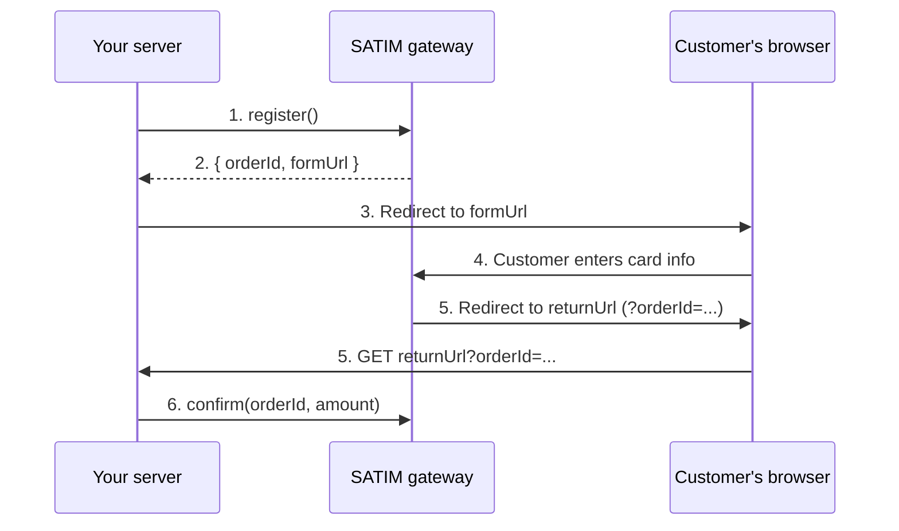

# Registering a Payment

To accept a payment, you first **register** an order with the SATIM gateway. Registration creates a payment session and returns a URL to the SATIM hosted payment form. You redirect your customer to this form, where they enter their CIB card details. SATIM handles the card data — it never touches your server.

This page covers everything you need to know about the registration step: required and optional configuration, how amounts work, how to use idempotent registration to prevent duplicate charges, and how each method behaves under the hood.

---

## How registration works



**Step 1–2:** Your server calls `register()`. The SDK sends a POST request to SATIM's `/register.do` endpoint with the payment details. SATIM returns an `orderId` (a unique identifier for this payment session) and a `formUrl` (the URL of the hosted payment page).

**Step 3:** You redirect the customer's browser to the `formUrl`. SATIM serves a secure payment page where the customer enters their CIB card number, expiration date, and CVV.

**Step 4–5:** After the customer submits (or cancels), SATIM redirects their browser back to your `returnUrl` (or `failUrl`) with the `orderId` as a query parameter.

**Step 6:** You verify the payment server-to-server using `confirm()`. This is covered in [Verifying a Payment](04-verifying-payment.md).

---

## Basic example

```typescript
const payment = await satim
    .amount(1500)                                        // 1500 DZD
    .description("Order #12345")                         // Shown on the payment page
    .returnUrl("https://your-app.com/payment/callback")  // Where to send the customer after payment
    .failUrl("https://your-app.com/payment/fail")        // Where to send on failure (optional)
    .language("FR")                                      // Payment page language: FR, AR, or EN
    .userDefinedFields({ customer_id: "890" })           // Custom metadata (forwarded to SATIM)
    .register();

// Store the orderId in your database — you'll need it for verification
const orderId = payment.getOrderId();

// Redirect the customer to the SATIM hosted payment page
return payment.redirectResponse(); // Returns an HTTP 302 Response object
```

---

## Configuration methods

Every setter method returns a new `Satim` instance (the fluent interface is immutable). You can chain them in any order, but `amount()` and `returnUrl()` must be called before `register()` — they are required.

### Required methods

| Method | Parameter | Description |
|---|---|---|
| `amount(n)` | `number` | The payment amount in **major currency units** (e.g., dinars, not centimes). The SDK converts to minor units (centimes) automatically when building the SATIM request. Must be a whole number of dinars, at least 50 DA, and no more than 9,999,999,999.99. |
| `returnUrl(url)` | `string` | The URL where SATIM redirects the customer after a successful payment (or after any terminal state). SATIM appends `?orderId=<id>` to this URL. Must be a valid `http://` or `https://` URL. |

### Optional methods

| Method | Parameter | Default | Description |
|---|---|---|---|
| `failUrl(url)` | `string` | Same as `returnUrl` | Where to redirect on failure. If not set, SATIM uses the `returnUrl` for all outcomes. Providing a separate fail URL lets you show a different page for failed payments. |
| `description(text)` | `string` | None | Human-readable text displayed on the SATIM payment page. Maximum 598 characters. Must not contain HTML markup characters (`<` or `>`). |
| `language(lang)` | `"FR"`, `"AR"`, or `"EN"` | `"FR"` | The language of the SATIM hosted payment page. |
| `orderNumber(n)` | `string \| number` | Random 10-char numeric | A custom order number. Per the SATIM spec this is AN.10 — alphanumeric, 1–10 characters (e.g., `"403"`, `"INV12345"`, `9999999999`). Numbers are auto-converted to strings. If you don't set this, the SDK generates a cryptographically random 10-digit numeric string. If you re-use a value that was already registered, SATIM returns an error (ErrorCode 1). |
| `timeout(seconds)` | `number` | Gateway default | How long (in seconds) the payment session remains valid before expiring. Range: 600 (10 minutes) to 86,400 (24 hours). If the customer does not complete payment within this time, the session expires and `isExpired()` returns true on the confirmation response. |
| `currency(code)` | `"DZD"`, `"USD"`, or `"EUR"` | `"DZD"` | The payment currency. Mapped to ISO 4217 numeric codes internally: DZD = 012, USD = 840, EUR = 978. |
| `userDefinedField(key, value)` | Two `string` args | None | Add a single custom key-value pair to the payment metadata. The key must be non-empty, non-numeric, not a reserved key, and max 128 characters. The value must be max 20 characters (SATIM AN.20 limit). Forwarded inside the `jsonParams` object. |
| `userDefinedFields(fields)` | `Record<string, string>` | None | Batch version of `userDefinedField()`. Validates each pair individually. |
| `dynamicCallbackUrl(url)` | `string` | None | A server-to-server webhook URL. SATIM POSTs a notification to this URL when the order status changes, independently of the customer redirect. See [Advanced Features](06-advanced-features.md) for details. |
| `idempotencyKey(key)` | `string` | None | An idempotency key for safe retries. 1–128 characters, alphanumeric plus hyphens and underscores. When set, SATIM returns the same response for duplicate requests instead of creating a new order. Also enables automatic retries on `register()`. See the idempotency section below. |

---

## Amount validation rules

The `amount()` method enforces several rules to prevent common payment errors. If any rule is violated, it throws a `SatimInvalidArgumentError` with a descriptive message.

| Rule | Error message | Example |
|---|---|---|
| Must be a JavaScript `number` type | `"Amount must be a number, got array."` | `amount([100])` — arrays, objects, booleans, strings, `null`, and `undefined` are all rejected at runtime even if TypeScript would catch them at compile time |
| Must be positive and finite | `"Amount must be a finite positive number."` | `amount(0)`, `amount(-5)`, `amount(Infinity)`, `amount(NaN)` |
| Must not exceed 9,999,999,999.99 | `"Amount exceeds safe precision for minor-unit conversion."` | `amount(10_000_000_000)` |
| Must not have more than 2 decimal places | `"Amount must not have more than 2 decimal places."` | `amount(99.999)` |
| Must be at least 50 DA (5000 centimes) | `"Amount must be at least 50 DA (5000 centimes) per SATIM requirements."` | `amount(10)` |
| Must be a whole number of dinars | `"Amount must be a multiple of 100 centimes (whole dinars only) per SATIM requirements."` | `amount(99.50)` |

> **Why runtime type checks?** TypeScript prevents passing an array or object as a `number` at compile time, but if you use the SDK from plain JavaScript, or if your TypeScript code receives values from an external API (`req.body.amount`), these runtime guards catch the mistake with a clear error message instead of silently coercing it (e.g., `Number([100]) === 100` in JavaScript).

---

## Registration response

When `register()` succeeds, it returns a `RegisterResponse` object with these methods:

| Method | Returns | Description |
|---|---|---|
| `getOrderId()` | `string` | The unique identifier SATIM assigned to this payment session. Store this in your database — you need it to verify the payment later with `confirm()`. |
| `getUrl()` | `string` | The URL of the SATIM hosted payment form. Redirect the customer here. |
| `redirectResponse()` | `Response` | A standard Web API `Response` object with a 302 redirect to the payment form URL. Works directly with Hono, Elysia, Bun's HTTP server, and Cloudflare Workers. For Express, use `res.redirect(payment.getUrl())` instead. |
| `getRawResponse()` | `RegisterOrderResponse` | A sanitized copy of the full gateway response, for debugging. |

### Using `redirectResponse()` with different frameworks

```typescript
// Hono / Elysia / Bun / Cloudflare Workers — return the Response directly
app.post("/checkout", async (c) => {
    const payment = await satim.amount(1500).returnUrl(url).register();
    return payment.redirectResponse();
});

// Express — use res.redirect() instead
app.post("/checkout", async (req, res) => {
    const payment = await satim.amount(1500).returnUrl(url).register();
    res.redirect(payment.getUrl());
});

// Next.js API route
export async function POST(request: Request) {
    const payment = await satim.amount(1500).returnUrl(url).register();
    return payment.redirectResponse();
}
```

> **Security:** `redirectResponse()` validates that the `formUrl` returned by SATIM uses HTTPS and points to a known SATIM domain (`satim.dz`, `cib.satim.dz`, `test.satim.dz`, or `test2.satim.dz`). If the gateway returns an unexpected hostname, the method throws a `SatimInvalidArgumentError` rather than redirecting the customer to a potentially malicious site.

---

## URL validation and SSRF protection

All URL methods (`returnUrl`, `failUrl`, `dynamicCallbackUrl`) validate the provided URL against a comprehensive set of rules to prevent Server-Side Request Forgery (SSRF) attacks:

| Blocked pattern | Examples |
|---|---|
| Non-HTTP(S) schemes | `ftp://`, `file://`, `javascript:` |
| Localhost and loopback | `localhost`, `127.0.0.1`, `[::1]` |
| Private IPv4 ranges | `10.x.x.x`, `172.16-31.x.x`, `192.168.x.x`, `169.254.x.x` |
| Private IPv6 ranges | `fc00::/7` (unique local), `fe80::/10` (link-local), IPv4-mapped variants |
| Cloud metadata endpoints | `metadata.google.internal`, `169.254.169.254` |
| Non-standard IP encodings | Decimal (`2130706433`), octal (`0177.0.0.1`), hex (`0x7f.0.0.1`) |

If a URL is rejected, the SDK throws a `SatimInvalidArgumentError` with a descriptive message explaining which rule was violated.

---

## Idempotent registration with `safeRegister()`

### The problem

The basic `register()` method creates a **new** order every time you call it. If the network fails mid-request and your code retries, you might end up with two orders for the same purchase — and potentially charge the customer twice.

### The solution

`safeRegister()` wraps `register()` with automatic idempotency. You pass your internal order reference (e.g., a cart ID or invoice number), and the SDK derives a deterministic idempotency key and order number from it. If the same reference is registered twice, SATIM returns the same orderId — no duplicate charge.

```typescript
// Your internal order reference — same ref always produces the same SATIM order
const merchantRef = "cart-abc-123";

const payment = await satim
    .amount(1500)
    .returnUrl("https://your-app.com/callback")
    .safeRegister(merchantRef);

const orderId = payment.getOrderId(); // Same orderId every time for "cart-abc-123"
```

### How it works internally

1. **Derives an idempotency key:** Computes `SHA-256("register|cart-abc-123|1500|012")` and prefixes it with `dk_`. This key is sent to SATIM as `externalRequestId`.
2. **Derives a stable order number:** Computes a deterministic 10-character numeric string from the merchant ref. Same ref always gets the same order number.
3. **Enables retries:** Because the idempotency key guarantees deduplication on the gateway side, retries are safe. The SDK automatically enables them.
4. **Handles duplicates:** If SATIM returns ErrorCode "1" (order already registered), the SDK throws a `SatimDuplicateOrderError` with the `merchantRef` so you can look up the original orderId.

> **Domain separation:** `safeRegister()` and `safeRegisterPreAuth()` include the payment type (`"register"` vs `"preauth"`) in the key derivation. This means the same `merchantRef` produces **different** idempotency keys and order numbers for each method, preventing collisions between standard payments and pre-authorization holds.

### When to use `safeRegister()` vs `register()`

| Scenario | Use |
|---|---|
| You have a stable internal reference for each order | `safeRegister(merchantRef)` — simplest and safest |
| You manage idempotency yourself (e.g., database-level dedup) | `register()` with `.idempotencyKey(yourKey)` |
| One-off test or script where duplicates don't matter | `register()` with no idempotency key |

### Pre-authorization variant

`safeRegisterPreAuth(merchantRef)` works identically but registers a **fund hold** instead of a full capture. It uses separate key derivation (mode `"preauth"`) so the same `merchantRef` will not collide with a `safeRegister()` call. See [Advanced Features](06-advanced-features.md) for details on pre-authorization flows.

---

## Error handling during registration

Registration can fail for several reasons. Each failure type maps to a specific error class:

| Error class | When it's thrown | What to do |
|---|---|---|
| `SatimMissingDataError` | You forgot to call `amount()` or `returnUrl()` before `register()`. | Add the missing configuration before calling `register()`. |
| `SatimInvalidArgumentError` | A configuration value is invalid (bad URL, out-of-range amount, etc.). | Fix the invalid value. The error message describes exactly what's wrong. |
| `SatimInvalidCredentialsError` | SATIM rejected your username, password, or terminal ID (ErrorCode 5). | Check your credentials. Make sure you're using test credentials with test mode and production credentials without it. |
| `SatimGatewayError` (code "1") | The order number was already registered (duplicate). | Use `safeRegister()` to handle this automatically. Or generate a new random order number and retry. |
| `SatimGatewayError` (code "3") | SATIM doesn't recognize the currency code. | Use one of the supported currencies: `"DZD"`, `"USD"`, or `"EUR"`. |
| `SatimGatewayError` (code "4") | A required parameter is missing from the request. | This usually indicates an SDK bug. Report it. |
| `SatimGatewayError` (code "7") | Internal system error on the SATIM side. | Retry after a delay. If persistent, contact CIBWeb support. |
| `SatimUnexpectedResponseError` | Network failure, timeout, malformed response, or circuit breaker open. | Check `err.errorCategory` for the specific cause (see [Initialization](02-initialization.md) for circuit breaker details). |
| `SatimDuplicateOrderError` | `safeRegister()` detected that this merchant ref was already registered with a different amount or currency. | Look up the original orderId using your merchant ref and call `status()` to check its state. |

### Example: comprehensive error handling

```typescript
import {
    Satim,
    SatimMissingDataError,
    SatimInvalidArgumentError,
    SatimInvalidCredentialsError,
    SatimGatewayError,
    SatimUnexpectedResponseError,
    SatimDuplicateOrderError,
} from "numeric";

try {
    const payment = await satim
        .amount(1500)
        .returnUrl("https://your-app.com/callback")
        .safeRegister("cart-abc-123");

    return payment.redirectResponse();
} catch (err) {
    if (err instanceof SatimDuplicateOrderError) {
        // This cart was already registered — redirect to the existing payment
        const existingOrderId = await db.orders.findByCartId(err.merchantRef);
        return Response.redirect(`/payment/status?orderId=${existingOrderId}`);
    }
    if (err instanceof SatimInvalidCredentialsError) {
        console.error("SATIM credentials are invalid — check environment variables");
        return new Response("Payment service configuration error", { status: 500 });
    }
    if (err instanceof SatimUnexpectedResponseError) {
        if (err.errorCategory === "circuit_open") {
            return new Response("Payment gateway temporarily unavailable", { status: 503 });
        }
        console.error(`SATIM error [${err.errorCategory}]: ${err.message}`);
        return new Response("Payment gateway error", { status: 502 });
    }
    if (err instanceof SatimGatewayError) {
        console.error(`SATIM gateway error [${err.errorCode}]: ${err.errorMessage}`);
        return new Response("Payment could not be processed", { status: 502 });
    }
    throw err; // Unexpected error — let it propagate
}
```

---

## Next step

After the customer completes (or abandons) the payment on the SATIM hosted form, you need to verify the result. Proceed to [Verifying a Payment](04-verifying-payment.md).
