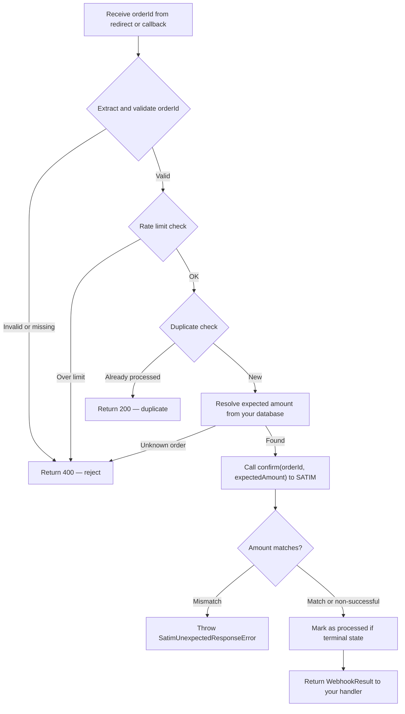

# Verifying a Payment

After a customer completes (or abandons) the SATIM hosted payment form, your application must **verify** the payment result server-to-server. This is the most critical step in the entire payment flow — skipping it or doing it incorrectly can lead to fulfilling unpaid orders, double-charging customers, or missing successful payments entirely.

This page explains both verification approaches (the recommended webhook handler and the lower-level `confirm()` method), every configuration option, how duplicate detection works across single and multi-instance deployments, and the full set of status predicates and response accessors.

---

## Why verification is required

When SATIM redirects the customer back to your `returnUrl`, the redirect URL contains an `orderId` query parameter. That is the **only** piece of information you receive from the customer's browser, and you must **never trust it on its own**. Here is why:

1. **The customer can modify the URL.** A user could change the `orderId` parameter to a different order's ID, or craft a URL entirely from scratch.
2. **The redirect can be replayed.** A customer (or an attacker) could bookmark the success URL and visit it repeatedly.
3. **The redirect can be lost.** The customer might close their browser before the redirect completes. The payment may have succeeded, but you never received the redirect.
4. **The callback payload is unsigned.** SATIM does not sign its `dynamicCallbackUrl` payloads with an HMAC or similar mechanism, so any POST to your webhook endpoint could be forged.

The only reliable way to know the true state of a payment is to ask SATIM directly, server-to-server, using the `orderId`. That is what both `confirm()` and the webhook handler do.

---

## Verification flow overview



---

## Recommended approach: webhook handler

The `createWebhookHandler()` method provides a zero-trust verification pipeline that handles both `returnUrl` redirects and `dynamicCallbackUrl` server-to-server callbacks through a single interface. It encapsulates duplicate detection, rate limiting, amount verification, and orderId sanitization so you do not have to implement these yourself.

### Creating the handler

```typescript
const webhook = satim.createWebhookHandler({
    // Required: look up the expected amount for this order from your database
    onResolveAmount: async (orderId) => {
        const order = await db.orders.findByPaymentId(orderId);
        return order?.totalAmount; // e.g. 1500 (DZD), or undefined if unknown
    },

    // Optional: plug in Redis, a database, etc. for distributed deployments
    onCheckDuplicate: async (orderId) => {
        return await redis.sismember("processed_payments", orderId);
    },
    onMarkProcessed: async (orderId) => {
        await redis.sadd("processed_payments", orderId);
    },
});
```

### Using the handler in your HTTP routes

```typescript
// Handle dynamicCallbackUrl POST from SATIM
app.post("/webhooks/satim", async (req) => {
    const result = await webhook.verify(req.body);

    if (!result) {
        // orderId was invalid, unknown, or rate-limited
        return new Response("Unknown or invalid order", { status: 400 });
    }
    if (result.duplicate) {
        // Already processed — respond 200 so SATIM does not retry the callback
        return new Response("Already processed", { status: 200 });
    }
    if (result.response.isSuccessful()) {
        await fulfillOrder(result.orderId);
    }
    return new Response("OK", { status: 200 });
});

// Handle returnUrl redirect — the same handler works
app.get("/checkout/success", async (req) => {
    const result = await webhook.verify(req.url);
    if (!result) return new Response("Invalid payment reference", { status: 400 });
    if (result.duplicate) return Response.redirect("/order/thank-you");
    if (result.response.isSuccessful()) {
        await fulfillOrder(result.orderId);
        return Response.redirect("/order/thank-you");
    }
    return Response.redirect("/order/failed");
});
```

### What `verify()` does internally

Each call to `verify()` executes the following pipeline in order. If any step rejects the request, `verify()` returns `null` (for invalid/unknown inputs) or a `WebhookResult` with `duplicate: true`.

| Step | What happens | Rejection behavior |
|---|---|---|
| **1. Extract orderId** | Parses the orderId from whichever input format was provided (see "Input formats" below). Validates format: alphanumeric + hyphens, 1–128 characters. | Returns `null` if the orderId is missing, empty, or fails the format check. |
| **2. Rate limit** | Checks a sliding-window rate limiter. Default: 100 callbacks per 60-second window. Prevents callback flooding attacks. | Returns `null` if the rate limit is exceeded. |
| **3. In-flight lock** | Checks whether another `verify()` call for the same orderId is already in progress. This prevents a race condition where two concurrent calls both pass the duplicate check before either marks the order as processed — which would cause double-fulfillment. | If another call is in-flight, waits for it to complete, then returns the result as a duplicate. |
| **4. Duplicate check** | Calls your `onCheckDuplicate` function (or checks the in-memory `Set` fallback) to determine whether this orderId has already been processed. | If duplicate, still calls `confirm()` to get the latest state, but returns `{ duplicate: true }`. |
| **5. Resolve expected amount** | Calls your `onResolveAmount` function to look up the amount you expect for this orderId. This is your database — the source of truth. | Returns `null` if `onResolveAmount` returns `undefined` or `null` (unknown order). |
| **6. Server-to-server confirm** | Calls `satim.confirm(orderId, expectedAmount)` to fetch the live authoritative payment state from the SATIM gateway. This is a real HTTP request to SATIM — not a cache lookup. | Throws `SatimUnexpectedResponseError` if the gateway is unreachable or returns a malformed response. |
| **7. Amount verification** | If the payment is successful (OrderStatus 2), the SDK automatically verifies that the gateway-reported amount matches the expected amount. | Throws `SatimUnexpectedResponseError` if amounts do not match. |
| **8. Mark as processed** | Calls your `onMarkProcessed` function (or adds to the in-memory `Set` fallback). Only called for terminal states — pending payments are **not** marked, so the webhook handler will re-verify them on the next callback. | — |

### Input formats

The `verify()` method accepts any of the following input formats. It figures out how to extract the orderId automatically.

| Input type | Example | How orderId is extracted |
|---|---|---|
| Plain orderId string | `"abc-123"` | Used directly after format validation |
| URL string with `?orderId=` | `"https://your-app.com/success?orderId=abc-123"` | Parsed as a URL, `orderId` extracted from query parameters |
| Object with `orderId` property | `{ orderId: "abc-123" }` | Read from the `orderId` property |
| Web API `Request` object | `request` | The `request.url` is parsed, `orderId` extracted from query parameters |
| URL string starting with `?` | `"?orderId=abc-123"` | Parsed as a query string |

> **OrderId format:** Only alphanumeric characters and hyphens are accepted. Maximum 128 characters. Anything else is silently rejected (returns `null`) without making a gateway call. This prevents injection attacks through malformed orderIds.

---

## Configuration options reference

| Option | Type | Default | Required | Description |
|---|---|---|---|---|
| `onResolveAmount` | `(orderId: string) => Promise<number \| undefined \| null> \| number \| undefined \| null` | — | Yes | Called to look up the expected payment amount (in major currency units) for a given orderId. This is your source of truth — typically a database query. Return the same amount you originally passed to `register()`. Return `undefined` or `null` to reject the callback as an unknown order. |
| `onCheckDuplicate` | `(orderId: string) => Promise<boolean> \| boolean` | In-memory `Set` | No | Called to check whether an orderId has already been processed. Return `true` to treat the callback as a duplicate. If not provided, the handler uses an in-memory `Set` (see "Multi-instance deployments" below). |
| `onMarkProcessed` | `(orderId: string) => Promise<void> \| void` | In-memory `Set` | No | Called after a successful (non-duplicate) verification to mark the orderId as processed. Only called for terminal states — pending payments remain re-verifiable. If not provided, the handler adds to the in-memory `Set`. |
| `maxCallbacksPerWindow` | `number` | `100` | No | The maximum number of callbacks accepted within the rate-limit window. Must be a positive integer. If your application processes high callback volumes, increase this value. |
| `rateLimitWindowMs` | `number` | `60000` | No | The duration of the rate-limit sliding window in milliseconds. Must be at least 1000 (1 second). The default is 60,000 (1 minute). |
| `suppressMultiInstanceWarning` | `boolean` | `false` | No | When `true`, suppresses the `console.warn` emitted when neither `onCheckDuplicate` nor `onMarkProcessed` is provided. See "Multi-instance deployments" below. |

---

## Multi-instance deployments

### The problem

When you do not provide `onCheckDuplicate` and `onMarkProcessed`, the webhook handler falls back to an in-memory JavaScript `Set` for duplicate tracking. This works correctly in **single-process** deployments — one Node.js process, one set of tracked orderIds.

However, in **multi-instance** deployments — Kubernetes pods, Heroku dynos, PM2 cluster mode, serverless functions (AWS Lambda, Cloudflare Workers, Vercel) — each process/instance has its own in-memory `Set`. They do not share state. This means:

- SATIM sends a callback to instance A. Instance A processes it and adds the orderId to its local `Set`.
- SATIM retries (or the customer reloads), and the retry hits instance B. Instance B's `Set` does not contain the orderId, so it processes it again — **double-fulfillment**.

The SDK warns you about this at construction time by emitting a `console.warn`:

```
[numeric] WebhookHandler: using in-memory duplicate tracking. This is only safe for
single-process deployments. In multi-instance environments (Kubernetes, multiple dynos,
serverless) provide onCheckDuplicate and onMarkProcessed backed by a shared store (e.g.
Redis, your database). Set suppressMultiInstanceWarning: true to silence this warning.
```

### The solution: shared-store deduplication

Provide `onCheckDuplicate` and `onMarkProcessed` backed by a data store that all instances can access. Here are examples for common options:

**Redis (recommended for high throughput):**

```typescript
const webhook = satim.createWebhookHandler({
    onResolveAmount: async (orderId) => {
        const order = await db.orders.findByPaymentId(orderId);
        return order?.totalAmount;
    },
    onCheckDuplicate: async (orderId) => {
        return Boolean(await redis.sismember("processed_payments", orderId));
    },
    onMarkProcessed: async (orderId) => {
        await redis.sadd("processed_payments", orderId);
    },
});
```

**PostgreSQL / MySQL / any SQL database:**

```typescript
const webhook = satim.createWebhookHandler({
    onResolveAmount: async (orderId) => {
        const order = await db.orders.findByPaymentId(orderId);
        return order?.totalAmount;
    },
    onCheckDuplicate: async (orderId) => {
        const row = await db.processedPayments.findUnique({ where: { orderId } });
        return row !== null;
    },
    onMarkProcessed: async (orderId) => {
        await db.processedPayments.create({ data: { orderId, processedAt: new Date() } });
    },
});
```

**MongoDB:**

```typescript
const webhook = satim.createWebhookHandler({
    onResolveAmount: async (orderId) => {
        const order = await Order.findOne({ paymentId: orderId });
        return order?.totalAmount;
    },
    onCheckDuplicate: async (orderId) => {
        const doc = await ProcessedPayment.findOne({ orderId });
        return doc !== null;
    },
    onMarkProcessed: async (orderId) => {
        await ProcessedPayment.create({ orderId, processedAt: new Date() });
    },
});
```

### Silencing the warning for confirmed single-process deployments

If you have verified that your application runs as a single process and will not be scaled horizontally, you can silence the warning:

```typescript
const webhook = satim.createWebhookHandler({
    onResolveAmount: async (orderId) => getAmount(orderId),
    suppressMultiInstanceWarning: true,
});
```

> **When in doubt, use a shared store.** The cost of a Redis or database lookup per webhook is negligible compared to the cost of double-fulfilling an order. Even if you are running a single process today, you may scale to multiple instances in the future.

---

## Manual verification with `confirm()`

If the webhook handler is too opinionated for your use case, you can call `confirm()` directly. This gives you full control over duplicate detection, rate limiting, and error handling, but you are responsible for implementing those yourself.

### Basic usage

```typescript
const url = new URL(request.url);
const orderId = url.searchParams.get("orderId");

if (!orderId) {
    return new Response("Missing orderId", { status: 400 });
}

// The second argument (expectedAmount) is required.
// confirm() automatically verifies that the captured amount matches
// when the payment is successful — preventing partial-payment exploits.
const response = await satim.confirm(orderId, expectedCartTotal);

if (response.isSuccessful()) {
    const message = response.getSuccessMessage();
    return new Response(`Payment confirmed: ${message}`);
}

if (response.isPending()) {
    return new Response("Payment not yet completed. Please try again.");
}

if (response.isRejected()) {
    return new Response(`Payment rejected: ${response.getErrorMessage()}`);
}

if (response.isCancelled()) {
    return new Response("Payment was cancelled by the customer.");
}

if (response.isExpired()) {
    return new Response("Payment session expired.");
}

if (response.isReversed()) {
    return new Response("Payment was reversed.");
}

return new Response(`Payment failed: ${response.getErrorMessage()}`);
```

### Parameter validation

Both `orderId` and `expectedAmount` are validated with runtime type guards:

| Parameter | Validation | Error on invalid |
|---|---|---|
| `orderId` | Must be a `string` (not a number, array, or object). Must be non-empty, alphanumeric + hyphens, max 128 chars. | `SatimInvalidArgumentError` with a message describing the actual type received (e.g., `"got number"`) |
| `expectedAmount` | Must be a JavaScript `number` type (not an array, string, boolean, or object). Must be positive, finite, max 2 decimal places, within safe precision range. | `SatimInvalidArgumentError` with a message describing the actual type received (e.g., `"got array"`) |

> **Why runtime type checks?** In plain JavaScript, or when values come from HTTP request bodies (`req.body.amount`), TypeScript's compile-time checks are bypassed. For example, `Number([100]) === 100` in JavaScript — an array silently coerces to a number. The SDK catches this at runtime with an explicit `typeof` guard and a clear error message.

### Amount verification

When `confirm()` returns a successful payment (OrderStatus 2), the SDK automatically compares the gateway-reported amount to the `expectedAmount` you passed in. If they do not match, it throws a `SatimUnexpectedResponseError`. This prevents **partial-payment attacks** where an attacker manipulates the amount parameter to pay less than the order total.

Amount verification uses IEEE 754-safe conversion via `toMinorUnits()` — both the expected and actual amounts are converted to integer centimes before comparison, avoiding floating-point precision issues (e.g., `0.1 + 0.2 !== 0.3`).

Amount verification is **only** performed on successful payments. For failed, cancelled, expired, or pending payments, the response is returned without amount checks so you can inspect the actual failure reason using the status predicates.

### When to use `confirm()` vs `createWebhookHandler()`

| Use case | Recommendation |
|---|---|
| Standard e-commerce flow with webhooks and redirects | `createWebhookHandler()` — handles deduplication, rate limiting, and amount verification automatically |
| You already have your own duplicate detection and rate limiting infrastructure | `confirm()` — avoid layering redundant protections |
| You need custom control flow (e.g., conditional fulfillment based on payment status and external signals) | `confirm()` — full control over what happens after verification |
| Background worker that periodically polls for payment status | `status()` (no amount verification) for read-only checks, then `confirm()` when you're ready to act |

---

## Querying order status without side effects

The `status()` method queries the current state of an order via SATIM's `/getOrderStatus.do` endpoint. Unlike `confirm()`, it is a **read-only** operation — it does not deposit the payment or change the order state. It is also automatically retried on transient failures.

```typescript
const response = await satim.status(orderId);

if (response.isPending()) {
    console.log("Customer has not completed payment yet.");
}
if (response.isSuccessful()) {
    console.log("Payment was successful.");
}
```

Use `status()` when you want to check on a payment without committing to processing it — for example, in a dashboard, a monitoring job, or a customer-facing "check payment status" page.

---

## Status predicates

The `ConfirmResponse` object (returned by both `confirm()` and `status()`) exposes status predicates — boolean methods that tell you the current state of the payment. These predicates are **mutually exclusive**: for any given response, exactly one will return `true`.

| Method | OrderStatus / Signal | Description |
|---|---|---|
| `isSuccessful()` | OrderStatus `"2"` | The payment has been deposited. Money has moved from the customer's account. This is the only state where you should fulfill the order. |
| `isPending()` | OrderStatus `"0"` | The order has been registered but the customer has not completed payment yet. The payment session is still active. |
| `isPreAuthorized()` | OrderStatus `"1"` | Funds have been held on the customer's card but not yet captured. Used in pre-authorization flows (see [Advanced Features](06-advanced-features.md)). The hold will expire if not captured. |
| `isReversed()` | OrderStatus `"3"` | The authorization was voided before settlement. No money was moved. |
| `isRefunded()` | OrderStatus `"4"` | The payment was refunded. Money has been returned to the customer. |
| `isExpired()` | actionCode `"-2007"` | The payment session timed out. The customer did not complete payment within the configured `timeout` period. |
| `isCancelled()` | actionCode `"10"` or message match | The customer clicked the cancel button on the SATIM payment page. |
| `isRejected()` | Bank decline signals | The customer's bank explicitly declined the transaction. This could be due to insufficient funds, card restrictions, or fraud detection. |
| `isFailed()` | Catch-all | Returns `true` **only** when every other predicate returns `false`. This is a terminal failure state that does not fit any of the above categories. |

### Mutual exclusivity guarantee

The predicates follow a strict priority chain. Each composite predicate (like `isExpired()`) internally checks all higher-priority predicates first and returns `false` if any of them is `true`. This guarantees that you can check them in any order and always get a consistent result:

```typescript
// These two approaches produce identical behavior:

// Approach A: check in any order
if (response.isFailed()) { /* ... */ }
if (response.isSuccessful()) { /* ... */ }

// Approach B: if/else chain
if (response.isSuccessful()) { /* ... */ }
else if (response.isPending()) { /* ... */ }
else if (response.isPreAuthorized()) { /* ... */ }
else if (response.isReversed()) { /* ... */ }
else if (response.isRefunded()) { /* ... */ }
else if (response.isExpired()) { /* ... */ }
else if (response.isCancelled()) { /* ... */ }
else if (response.isRejected()) { /* ... */ }
else { /* isFailed() is true here */ }
```

---

## Response data accessors

The `ConfirmResponse` object provides typed accessor methods for common response fields. These are safer than reading the raw response directly because they handle missing fields, type normalization, and PII redaction.

| Method | Return type | Description |
|---|---|---|
| `getIpAddress()` | `string \| undefined` | The IP address of the cardholder at the time of payment, as reported by the gateway. |
| `getCardHolderName()` | `string \| undefined` | The cardholder name as returned by the card issuer. May not always be available. |
| `getCardExpiry()` | `string \| undefined` | The card expiration date in `YYYYMM` format (e.g., `"202712"` for December 2027). |
| `getCardPan()` | `string \| undefined` | The masked card PAN (e.g., `"4111**1111"`). Only partial digits are returned by SATIM — the full PAN is never exposed. |
| `getApprovalCode()` | `string \| undefined` | The authorization approval code from the card issuer. Present on successful transactions. |
| `getAmount()` | `number \| undefined` | The original order amount converted from minor units (centimes) back to major units (dinars). Returns `undefined` if the field is absent or non-numeric. |
| `getDepositAmount()` | `number \| undefined` | The actual debited (deposited) amount in major units. For standard payments, this equals `getAmount()`. For pre-authorization flows, it may be less than the original hold amount if a partial capture was performed. Returns `undefined` if the field is absent. |
| `getOrderNumber()` | `string \| undefined` | The order number as confirmed by the gateway. |
| `getSuccessMessage()` | `string` | A human-readable success or status message. Returns the gateway's `respCode_desc` or `actionCodeDescription` if available, otherwise a default like `"Payment was successful"` or `"Payment is pending"`. |
| `getErrorMessage()` | `string` | A human-readable error message. Returns a description based on the status (expired, cancelled, reversed, rejected) or the gateway's error description as a fallback. |
| `getRawResponse()` | `Record<string, unknown>` | A deep copy of the full gateway response with sensitive cardholder PII **redacted** (IP, PAN, name, expiration are replaced with `"[REDACTED]"`). Use this for debugging or logging — it is safe to write to logs. |

> **Security:** `getRawResponse()` automatically redacts all cardholder PII fields. You should **never** log the original response object directly. Always use `getRawResponse()` or the typed accessor methods.

---

## Next step

If you need to return money to a customer, proceed to [Refunds](05-refunds.md). For pre-authorization, reversal, and other advanced flows, see [Advanced Features](06-advanced-features.md).
