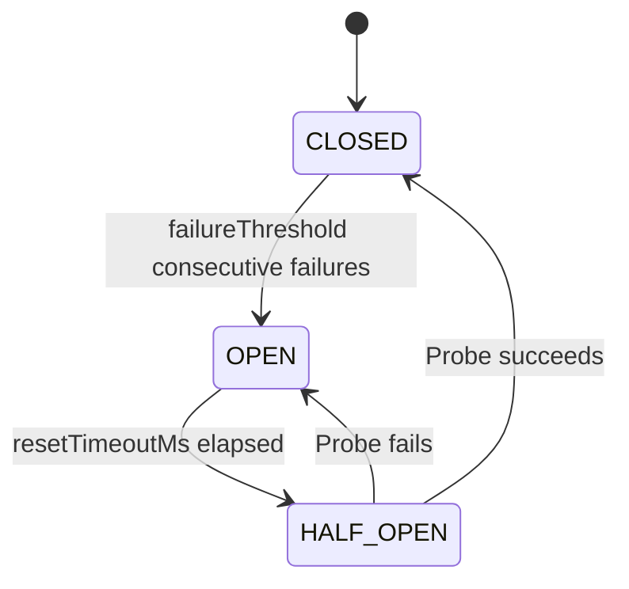
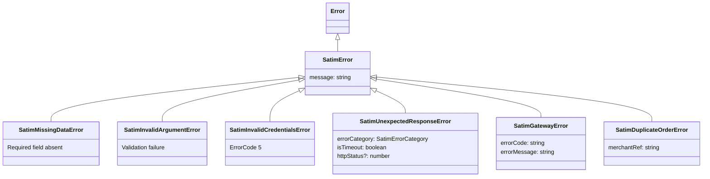

# Advanced Features

This page covers features beyond the core register-pay-verify flow: server-to-server webhooks, pre-authorization holds, order reversals, the error hierarchy, resilience features (circuit breaker, configurable timeout), integration testing, and SATIM gateway endpoint availability.

All endpoint availability information was verified against the SATIM test gateway on 2026-03-24.

---

## Server-to-server webhooks

### The problem with browser redirects alone

In the standard payment flow, SATIM redirects the customer's browser back to your `returnUrl` after payment. But this redirect can fail:

- The customer closes their browser before the redirect completes.
- The customer's internet connection drops.
- The customer navigates away from the payment page.
- A mobile app switches to the background during the redirect.

In all of these cases, the payment may have succeeded on SATIM's side, but your server never receives the redirect. Without a server-to-server callback, you would never know the payment was successful.

### The solution: `dynamicCallbackUrl`

The `dynamicCallbackUrl` parameter tells SATIM to POST a notification directly to your server when the order status changes. This notification is sent **independently** of the customer redirect — it happens server-to-server, so it is not affected by the customer's browser behavior.

```typescript
const payment = await satim
    .amount(1500)
    .dynamicCallbackUrl("https://api.your-app.com/webhooks/satim")
    .returnUrl("https://your-app.com/checkout/success")
    .register();
```

When you set both `dynamicCallbackUrl` and `returnUrl`, your application receives the payment notification through **two independent channels**. The first one to arrive triggers your fulfillment logic, and the webhook handler's duplicate detection ensures the second one is treated as a duplicate.

### Handling callbacks

Use `createWebhookHandler()` to process both `dynamicCallbackUrl` callbacks and `returnUrl` redirects through a single zero-trust verification pipeline:

```typescript
const webhook = satim.createWebhookHandler({
    onResolveAmount: async (orderId) => {
        const order = await db.orders.findByPaymentId(orderId);
        return order?.totalAmount;
    },
});

// Server-to-server callback from SATIM
app.post("/webhooks/satim", async (req) => {
    const result = await webhook.verify(req.body);
    if (!result) return new Response("Rejected", { status: 400 });
    if (result.duplicate) return new Response("OK", { status: 200 });
    if (result.response.isSuccessful()) {
        await fulfillOrder(result.orderId);
    }
    return new Response("OK", { status: 200 });
});

// Customer browser redirect — same handler works
app.get("/checkout/success", async (req) => {
    const result = await webhook.verify(req.url);
    // ... same logic as above
});
```

The handler **never trusts the callback payload**. It uses the orderId from the callback only as a trigger to make a fresh server-to-server `confirm()` call to SATIM, fetching the live authoritative payment state. This means even a perfectly forged or replayed callback only triggers a verification check — it cannot cause your application to fulfill an unpaid order.

For full documentation on the webhook handler (configuration options, duplicate detection, rate limiting, multi-instance deployments), see [Verifying a Payment](04-verifying-payment.md).

### Security considerations for webhook URLs

The SDK validates all callback URLs against private IP ranges and SSRF patterns at configuration time. The following are blocked:

- `localhost`, `127.0.0.1`, `[::1]`
- Private IPv4 ranges (`10.x`, `172.16-31.x`, `192.168.x`, `169.254.x`)
- Private IPv6 ranges (unique-local `fc00::/7`, link-local `fe80::/10`, IPv4-mapped variants)
- Cloud metadata endpoints (`metadata.google.internal`, `169.254.169.254`)
- Non-standard IP encodings (decimal, octal, hex)

> **DNS rebinding caveat:** The SDK validates the URL at configuration time, but the SATIM gateway resolves DNS at callback time. A DNS rebinding attack could theoretically cause the gateway to send the callback to an internal IP if the DNS record is changed between configuration and callback. The gateway's own network-level protections are the primary safeguard against this.

---

## Pre-authorization

Pre-authorization places a hold on the customer's card for a specified amount without actually capturing (depositing) the funds. The money is reserved but not moved. This is useful for:

- **Rental deposits:** Hold a security deposit and only capture if damage occurs.
- **Hotel bookings:** Hold the room cost at check-in, capture the final amount at check-out (which may differ due to minibar, late checkout, etc.).
- **Delayed-capture e-commerce:** Hold funds when the order is placed, capture when the item ships.

### Registering a pre-authorization

```typescript
const preAuth = await satim
    .amount(50000)                                           // Hold 50,000 DZD
    .returnUrl("https://your-app.com/rental/success")
    .description("Security deposit for rental #789")
    .registerPreAuth();

const orderId = preAuth.getOrderId();
const paymentPageUrl = preAuth.getUrl();

// Redirect the customer to the payment form — identical to register()
return preAuth.redirectResponse();
```

The pre-authorization flow is identical to the standard payment flow from the customer's perspective. The only difference is what happens on the backend:

| Standard payment (`register()`) | Pre-authorization (`registerPreAuth()`) |
|---|---|
| OrderStatus `"2"` = funds captured | OrderStatus `"1"` = funds held, not captured |
| Money moves immediately | Money is reserved; no movement until you confirm or reverse |

### Checking pre-authorization status

After the customer completes the pre-authorization form, verify the hold:

```typescript
const response = await satim.status(orderId);

if (response.isPreAuthorized()) {
    console.log("Funds are held. Ready to capture or release.");
}
if (response.isPending()) {
    console.log("Customer has not completed the pre-authorization yet.");
}
```

### Idempotent pre-authorization

Just like `safeRegister()` for standard payments, `safeRegisterPreAuth()` provides automatic idempotency for pre-authorizations:

```typescript
const preAuth = await satim
    .amount(50000)
    .returnUrl("https://your-app.com/rental/success")
    .safeRegisterPreAuth("rental-789");
```

Same guarantees as `safeRegister()`: deterministic idempotency key, deterministic order number, automatic retries, and `SatimDuplicateOrderError` on mismatched duplicate registrations.

### Security considerations for pre-authorization

Pre-authorization endpoints are a common target for **card testing attacks**. Attackers use stolen card numbers to make small pre-authorizations to verify which cards are valid before using them for larger fraudulent purchases. To protect against this:

1. **Rate-limit pre-authorization requests** at your application level (e.g., per user, per IP, per session).
2. **Enforce minimum hold amounts** — very small amounts (under 100 DZD) are a strong signal of card testing.
3. **Monitor pre-authorization volumes** — sudden spikes in pre-auth requests, especially with high failure rates, indicate an attack.
4. **Set reversal timeouts** — automatically reverse uncaptured holds after a business-logic deadline (e.g., 24 hours for rentals, 7 days for hotel bookings).

---

## Order reversal

A reversal (also called a void) cancels an authorization **before the acquirer settles the batch**. This is different from a refund:

| | Reversal (`reverseOrder()`) | Refund (`refund()`) |
|---|---|---|
| **When to use** | Before batch settlement (typically same business day) | After batch settlement |
| **Processing fees** | No processing fees | Processing fees apply |
| **Speed** | Immediate — the hold is released | 1–5 business days for the credit to appear |
| **Applicability** | Only for unsettled transactions | Any deposited transaction |

### Example

```typescript
const response = await satim.reverseOrder(orderId);

if (response.isReversed()) {
    console.log("Authorization voided successfully.");
}

if (response.isFailed()) {
    console.error(`Reversal failed: ${response.getErrorMessage()}`);
    // The transaction may have already been settled — try a refund instead
}
```

### When reversals fail

A reversal will fail if:

- The transaction has already been settled (batch has been processed). Use `refund()` instead.
- The `orderId` is invalid or does not correspond to a deposited or pre-authorized payment.
- The payment was already reversed.

Reversal requests are **not retried** by default because they are side-effecting operations. If you need to handle transient failures, implement application-level retry logic with your own idempotency mechanism.

---

## Resilience: circuit breaker and configurable timeout

The SDK includes built-in resilience features to handle SATIM gateway downtime gracefully. Full configuration details are in [Initialization](02-initialization.md). This section provides a quick reference.

### Configurable timeout

The default per-request timeout is 30 seconds. Adjust it based on your deployment environment and latency requirements:

```typescript
// Faster fail-over for latency-sensitive flows
const satim = new Satim(credentials, { timeoutMs: 10_000 });

// More headroom for high-load periods
const satim = new Satim(credentials, { timeoutMs: 60_000 });
```

Timeouts are classified as transient failures. If retries are enabled, a timed-out request is retried with exponential backoff. Timeouts also count toward the circuit breaker's failure threshold.

### Circuit breaker

The built-in circuit breaker prevents request pile-up during sustained SATIM downtime. After a configurable number of consecutive transient failures, all subsequent requests fail immediately without touching the network:

```typescript
const satim = new Satim(credentials, {
    timeoutMs: 10_000,
    maxRetries: 2,
    circuitBreaker: {
        failureThreshold: 5,     // open after 5 consecutive 5xx/timeout failures
        resetTimeoutMs: 30_000,  // try a recovery probe after 30 seconds
    },
});
```



Handling circuit-open errors in your application:

```typescript
import { SatimUnexpectedResponseError } from "satim-module";

try {
    const payment = await satim.amount(1500).returnUrl(url).register();
} catch (err) {
    if (err instanceof SatimUnexpectedResponseError) {
        if (err.errorCategory === "circuit_open") {
            return new Response("Payment gateway temporarily unavailable", {
                status: 503,
                headers: { "Retry-After": "60" },
            });
        }
        if (err.errorCategory === "timeout") {
            return new Response("Gateway timeout — please retry", { status: 504 });
        }
    }
    throw err;
}
```

To disable the circuit breaker entirely (e.g., in serverless environments where state is lost between invocations):

```typescript
const satim = new Satim(credentials, { circuitBreaker: false });
```

---

## Error hierarchy

The SDK uses a typed error hierarchy so you can catch errors at the specificity level that makes sense for your application. All SDK errors extend `SatimError`, which extends the built-in `Error` class.



| Error class | When thrown | Key properties |
|---|---|---|
| `SatimError` | Base class for all SDK errors. Catch this to handle any SDK error uniformly. | `message` |
| `SatimMissingDataError` | A required configuration value or API response field is absent. For example, calling `register()` without setting `amount()`. | `message` |
| `SatimInvalidArgumentError` | A method argument fails validation. For example, a negative amount, an invalid URL, or a non-string orderId. | `message` |
| `SatimInvalidCredentialsError` | The SATIM gateway rejected your username, password, or terminal ID (ErrorCode 5). | `message` |
| `SatimUnexpectedResponseError` | A network failure, timeout, malformed response, HTTP error, or circuit breaker rejection occurred. | `errorCategory` (`"network"`, `"timeout"`, `"parse"`, `"http"`, `"gateway"`, `"circuit_open"`, `"unknown"`), `isTimeout`, `httpStatus` |
| `SatimGatewayError` | The SATIM gateway returned a well-known error code (1, 3, 4, or 7). | `errorCode`, `errorMessage` |
| `SatimDuplicateOrderError` | `safeRegister()` or `safeRegisterPreAuth()` detected that the order was already registered with a different idempotency key. | `merchantRef` |

### Error categories on `SatimUnexpectedResponseError`

The `errorCategory` property classifies the underlying cause without exposing internal details:

| Category | Meaning | Typical action |
|---|---|---|
| `"network"` | The HTTP request failed due to a network-level issue (DNS resolution failure, connection refused, socket hang-up). | Check network connectivity. Retry if transient. |
| `"timeout"` | The request was aborted because it exceeded `timeoutMs`. | Increase `timeoutMs` or reduce retry count. |
| `"parse"` | The gateway returned a response that could not be parsed as JSON. | This is unexpected — likely a gateway issue. Log and alert. |
| `"http"` | The gateway returned an HTTP error status (4xx or 5xx). Check `httpStatus` for the specific code. | 5xx = retry. 4xx = check request parameters. |
| `"gateway"` | The response was valid JSON but contained an unexpected error code or amount mismatch. | Inspect the error message for details. |
| `"circuit_open"` | The circuit breaker is open — requests are being rejected without contacting the gateway. | Return a maintenance response. The circuit will automatically attempt recovery after `resetTimeoutMs`. |
| `"unknown"` | The error does not fit any of the above categories. | Log the full error for investigation. |

---

## Integration testing against the sandbox

The SDK ships a sandbox test suite in `tests/integration.test.ts` that runs against the real SATIM test gateway. Unlike the unit tests (which use mocks), integration tests catch gateway behavior changes — endpoint renames, response format changes, new error codes — before they reach production.

### Running integration tests

Set the three credential environment variables and run the test file directly:

```bash
SATIM_TEST_USERNAME=your_test_username \
SATIM_TEST_PASSWORD=your_test_password \
SATIM_TEST_TERMINAL=your_test_terminal \
  npx vitest run tests/integration.test.ts
```

### What the integration tests cover

| Test group | What it validates |
|---|---|
| `register()` | Registers a new order and verifies it returns a valid orderId and formUrl pointing to the test gateway. |
| Idempotency | Registers the same idempotency key twice and verifies both calls return the same orderId. |
| Duplicate detection | Registers with a fixed order number, then registers again with the same number. Verifies SATIM rejects the duplicate with a `SatimGatewayError`. |
| `status()` | Queries a freshly registered order and verifies it returns `isPending()`. Also tests that an unknown orderId throws `SatimInvalidArgumentError`. |
| `confirm()` | Confirms a pending (unpaid) order and verifies it returns a non-successful response (since no card details were entered). |
| `safeRegister()` | Tests idempotent registration and duplicate detection with mismatched amounts. |
| Invalid credentials | Verifies that bad credentials throw `SatimInvalidCredentialsError`. |
| Circuit breaker | Verifies that circuit breaker configuration is accepted without errors. |
| Configurable timeout | Verifies that a custom `timeoutMs` is accepted and the SDK functions normally. |

### CI/CD behavior

When the environment variables are absent (which is the case in most CI environments that do not have SATIM test credentials configured), the entire integration test file is **automatically skipped**. It does not fail or produce warnings. This means you can include `tests/integration.test.ts` in your test suite without worrying about it breaking CI when credentials are not available.

```bash
# Standard test run — integration tests are skipped
npm test

# With credentials — integration tests run
SATIM_TEST_USERNAME=u SATIM_TEST_PASSWORD=p SATIM_TEST_TERMINAL=t npm test
```

---

## Endpoint availability summary

The following table summarizes the results of live probing against the SATIM test gateway (`test2.satim.dz`). These results were last verified on 2026-03-24.

| Endpoint | Status | SDK method | Description |
|---|---|---|---|
| `/register.do` | Active | `register()`, `safeRegister()` | Standard payment registration. Creates a payment session and returns an orderId + payment form URL. |
| `/registerPreAuth.do` | Active | `registerPreAuth()`, `safeRegisterPreAuth()` | Pre-authorization registration. Holds funds without capturing them. |
| `/public/acknowledgeTransaction.do` | Active | `confirm()` | Confirms and deposits an order. Used for server-to-server payment verification. |
| `/getOrderStatus.do` | Active | `status()` | Read-only query of the current order state. Does not change the order. |
| `/refund.do` | Active | `refund()` | Issues a full or partial refund for a captured payment. |
| `/reverse.do` | Active | `reverseOrder()` | Voids an authorization before batch settlement. |
| `/paymentOrderBinding.do` | Disabled | — | Tokenized (card-on-file) payments. Not enabled on the test gateway. |
| `/recurrentPayment.do` | Disabled | — | Recurring/subscription billing. Not enabled on the test gateway. |

> **Disabled endpoints** return an error when called. They may become available in the future if SATIM enables them for your merchant account. Contact CIBWeb for information on tokenized and recurring payment availability.

---

## Next step

You have now covered all the features of the SDK. Refer back to any section as needed.
